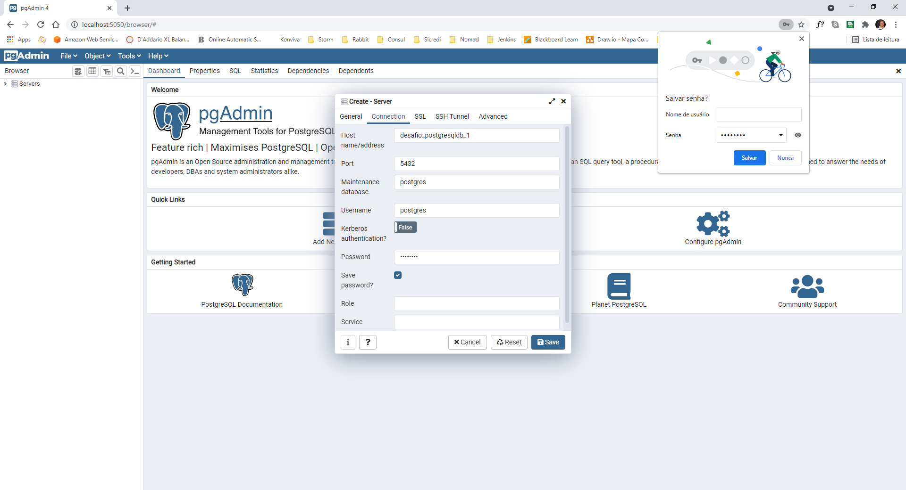

<h1 align="center">Importação de Arquivo e Higienização de Dados</h1>

Desafio Manipulação de dados e Persistência em base de dados relacional

resource/file:

Disponibilizado para desafio

base_teste.txt

Com 50000 registros.

base_teste2.txt

Com somente 1000 registros.

docker-compose up

Na ferramenta Postman, importar via link, collection referente ao serviço para executar o desafio
https://www.getpostman.com/collections/424023562b5df587e341
.

gradlew clean

gradlew build -x test

method: POST
http://localhost:8181/api/desafio/importa

method: POST
http://localhost:8181/api/desafio/higieniza

method: DELETE
http://localhost:8181/api/desafio/limpa

Executar a importação.

http://localhost:5050 

senha: postgres

Add New Server

Connection - HostName/address: desafio_postgresqldb_1 Password: postgres

pgAdmin4 para acessar o Postgres com os dados importados

Executar a Higienização.

select * from TB_CLIENTE;

SELECT * FROM TB_CLIENTE WHERE cpf_valido = false

